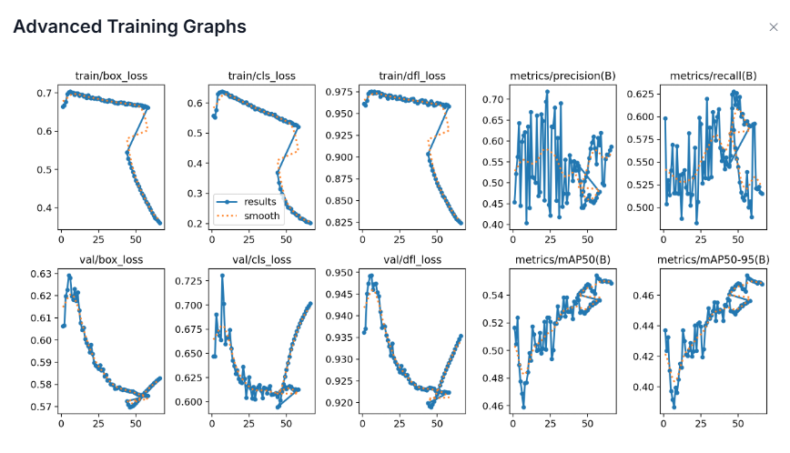
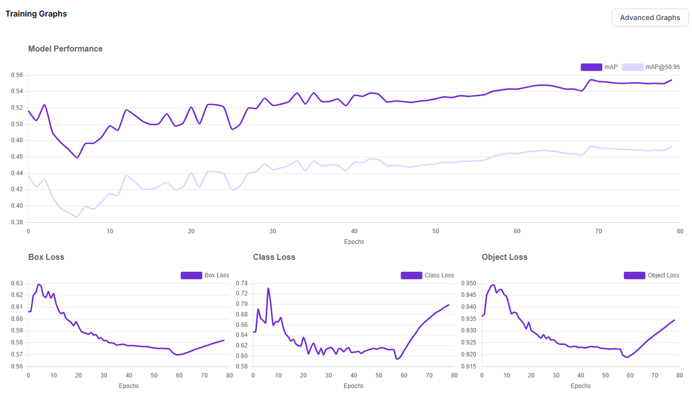
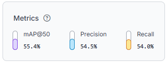
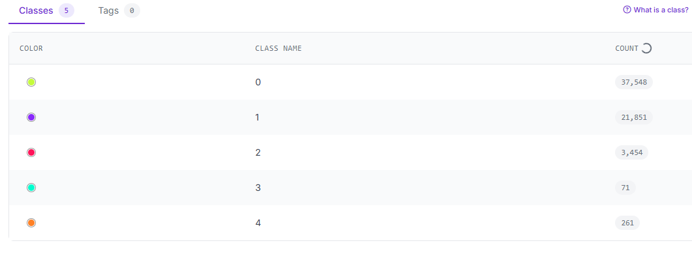
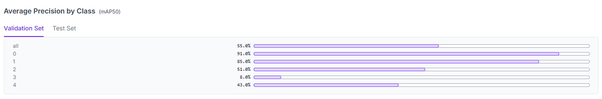

# Palm Fruit Quality Detection Model Train Result Analysis

## 🧠 Loss (Training dan Validation)
🖼️ **GAMBAR 1**

🖼️ **GAMBAR 2**

**CONTEXT**: 
- *y-axis*: metrics value
- *x-axis*: epoch value

✏️ **Analysis**: *Dari hasil metrics training dan validation (Gambar 1) menunjukkan training menghasilkan model yang tidak mengalami keadaan overfit/underfit secara general, karena delta loss antara loss train dan val masih ditahap acceptable (dl < 0.2) walaupun jika dilihat dari hasil training menghasilkan metrics loss yang masih lumayan tinggi, terkhusus di **Object Loss**. Hasil grafik logs training menunjukkan hasil yang stabil pada sisi train, namun pada sisi validasi terdapat banyak ripple/noise. Hal ini dapat terjadi karena beberapa hal seperti: 1. Data validation/test yang digunakan mempunyai jumlah kecil dan kurang variatif sehingga terjadi **imbalanced dataset**; 2. Menggunakan nilai **Learning Rate** yang tinggi. Hasil training masih dapat diperbaiki dengan melakukan **finetuning** metrics traing, **cleansing data** untuk mengecek dan menghilangkan data yang dapat menjadi noise, dan melakukan **augmentasi** yang disesuaikan dengan keadaan real dari sistem. Dapat dilihat juga pada Gambar 2 bahwa sebenarnya model sudah dapat belajar dengan baik hingga -+ 50 epoch, dan setelah itu semua metrics mengalami kenaikan yang signifikan yang bisa jadi menunjukkan bahwa model hanya mempelajari "ilmu" yang dari data training bukan mencari pola general dari data yang menunjukkan simptom akan terjadinya keadaan overfit pada model (Gambar 2).*

## 🧠 Matriks evaluasi seperti mAP, Precision, dan Recall

🖼️ **GAMBAR 3**

### 🔍 Definition (Reference: [YOLO Training Metrics Explanation](https://github.com/ultralytics/ultralytics/issues/9446))
- P (Precision = TP / (TP + FP)): Precision, the accuracy of positive predictions.
- R (Recall = TP / (TP + FN)): Recall, the ability of the model to detect all relevant instances.
- mAP50: Mean Average Precision at 50% IoU (Intersection over Union) threshold, a common metric for evaluating the accuracy of object detectors.
- mAP50-95: Mean Average Precision averaged over IoU thresholds from 50% to 95% (at 5% steps), providing a more comprehensive view of the model's performance across different levels of detection difficulty.

✏️ **Analysis**: *Berdasarkan beberapa hasil metrics training yolo model yang ditunjukkan oleh Gambar 1 s/d 3 hasilnya masih menunjukkan nilai loss yang besar. Sehingga jika disimpulkan hasil tersebut dapat berefek pada model deteksi yang kurang akurat, dan presisi dalam mendeteksi kelas, bounding box, ataupun object. Lalu untuk hasil mAP50 dan mAP50-95 menunjukkan bahwa hasilnya mungkin masih dapat diterima karena nilai tersebut masih dapat diterima terlebih jika data yang digunakan mempunyain banyak noise.*

## 🧠 Interpretasi terhadap performa model berdasarkan grafik

🖼️ **GAMBAR 4**

🖼️ **GAMBAR 5**

✏️ **Analysis**: *Berdasarkan performansi model yang ditunjukkan oleh Gambar 4 dan 5, menunjukkan bahwa masih terjadi ketimpangan nilai metrics mAP50 data validation pada beberapa kelas terutama untuk kelas 3 (Rotten) yang dimana mempunyain nilai mAP50 yang sangat kecil (8.0%). Hal ini dapat terjadi karena terjadinya keadaan **imbalanced** pada dataset yang digunakan yang digambarkan oleh Gambar 4 yang dimana untuk kelas 3 hanya mempunyai data sebanyak 71 gambar. Hal ini dapat mengakibatkan terjadinya keadaan **bias** dalam dilakukan deteksi pada objek yang berpengaruh terhadap sistem perhitungan yang dibuat menjadi kurang akurat.*